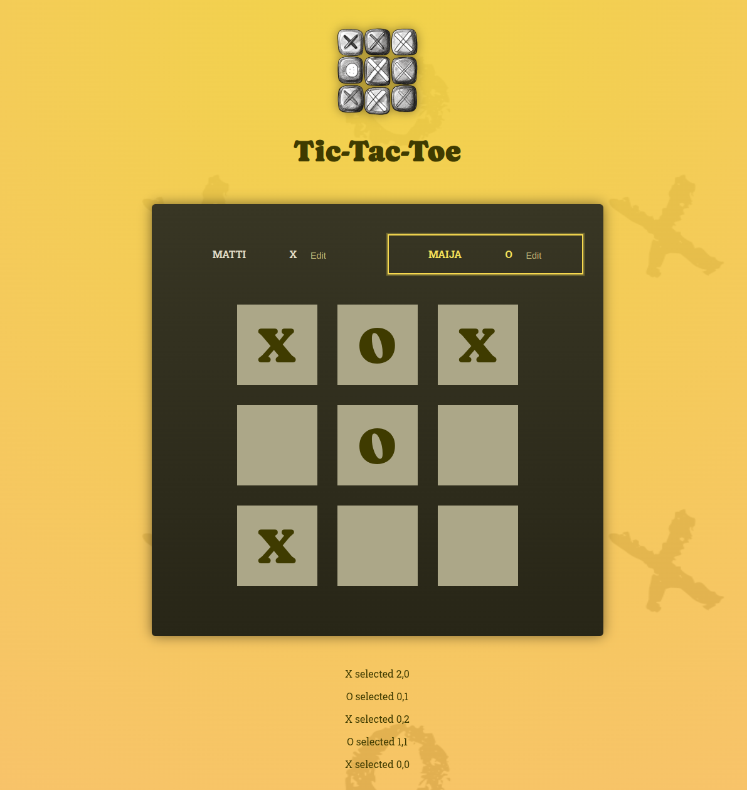

# React Tic-Tac-Toe

This is an educational React app built while following the ["React – The Complete Guide"](https://www.packtpub.com/en-us/product/react-the-complete-guide-includes-hooks-react-router-and-redux-9781801812603) video course by Maximilian Schwarzmüller, published by Packt.

The app demonstrates fundamental React concepts and is intended for personal learning.

## Features

- **Two-player Tic-Tac-Toe**: Players take turns selecting squares on a 3x3 grid.
- **Dynamic Player Names**: Players can edit their names during the game.
- **Game State Management**: Tracks turns, active player, and game board state.
- **Winner Detection**: Automatically detects when a player wins or if the game ends in a draw.
- **Rematch Option**: Restart the game with a single click.

## Screenshots

